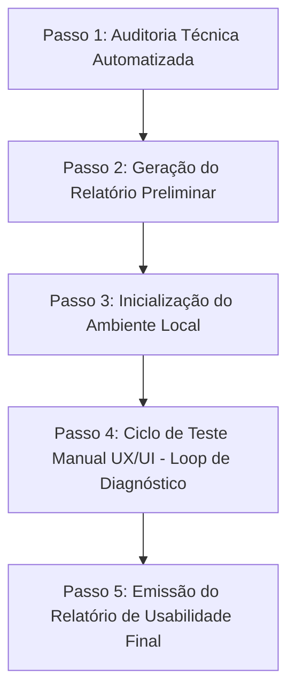

# Workflow: Auditoria de Usabilidade e UX Manual (audit_usability)

Este workflow combina a auditoria de qualidade automatizada de backend, frontend e banco de dados com uma **sessão de teste de usabilidade manual interativa**. Ele foi projetado para que a IA atue como uma parceira de diagnóstico focada em encontrar problemas de UI/UX, fluxos inconsistentes e erros de layout nas telas do Lava-Me (Web e Mobile), **sem alterar o código ou realizar qualquer commit ou push para o GitHub sem a confirmação explícita do usuário**.

---

## 🛡️ Regras de Ouro (Mandatórias)

> [!IMPORTANT]
> 1. **MODO ESTRITAMENTE LEITURA (READ-ONLY)**: Não execute NENHUMA alteração de código (ferramentas `replace_file_content`, `multi_replace_file_content` ou scripts de escrita) a menos que o usuário peça explicitamente ou aprove por escrito.
> 2. **SEM COMMITS OU PUSHES**: Nenhuma alteração de código ou de documentação deve ser commitada ou enviada ao GitHub sem a confirmação expressa do usuário.
> 3. **EXPLIQUE OS COMANDOS**: De acordo com a regra global `<RULE[user_global]>`, sempre que você sugerir ou pedir para rodar qualquer comando no terminal (ex: rodar pytest ou npm localmente), você **DEVE** explicar de antemão exatamente o que o comando faz e por que está sugerindo.
> 4. **FOCO EM TESTES E DIAGNÓSTICO**: Todo o input do usuário durante este workflow servirá para continuar testando e depurando o comportamento visual e de negócios.

---

## 🧠 Fluxo do Workflow



---

## 🛠️ Passo a Passo da IA (Auditor UX & Usabilidade)

### Passo 1: Auditoria Técnica Automatizada (Pre-Audit)
Antes do usuário testar as telas, execute as varreduras de código para verificar se o repositório está íntegro e compila sem erros:

1. **Qualidade Backend**: Execute a ferramenta `run_backend_tests` e `generate_backend_coverage` para verificar a estabilidade do Django.
2. **Qualidade Frontend**:
   - Para o Angular Web: Execute `run_web_tests` e `run_web_linter`.
   - Para os Apps Mobile (B2B e B2C): Execute `run_frontend_tests` e `run_frontend_linter`.
3. **Consistência de API e Banco**:
   - Execute `check_and_run_migrations` com `apply=False` para verificar se existem migrações pendentes.
   - Execute `verify_api_endpoints` para garantir a integridade dos contratos de API entre frontend e backend.
4. **Segurança e SAST**: Execute `run_security_audit` com `target="all"`.

### Passo 2: Geração do Relatório Técnico Preliminar
Apresente no chat um resumo em markdown com os resultados técnicos. Use o seguinte template para manter a uniformidade visual:

| Camada | Ferramenta | Status | Observação / Cobertura |
| :--- | :--- | :--- | :--- |
| **Backend (Django)** | `pytest` | `[🟢 Passou / 🔴 Falhou]` | Cobertura: XX% |
| **Frontend Web (Angular)** | `vitest/linter` | `[🟢 Passou / 🔴 Falhou]` | Dívidas de layout / lint |
| **Frontend Mobile (Ionic)** | `vitest/linter` | `[🟢 Passou / 🔴 Falhou]` | B2B (mobile) e B2C (mobile-cliente) |
| **Banco & Migrations** | `makemigrations` | `[🟢 Ok / ⚠️ Pendente]` | Status das Migrations |
| **Contrato de API** | `verify_endpoints` | `[🟢 Ok / 🔴 Erros]` | Chamadas órfãs detectadas |
| **Segurança** | `security_audit` | `[🟢 Seguro / 🔴 Vulnerável]` | Alertas de segurança/IDOR |

### Passo 3: Inicialização do Ambiente Local
Agora, prepare as telas para o usuário realizar os testes visuais manuais:

1. Chame a ferramenta MCP `mcp_lava-me-context-server_start_development_environment` para iniciar os 3 servidores em background.
2. Mostre para o usuário os links de acesso retornados pela ferramenta (ex: Django Admin, Angular Web, Ionic Mobile B2C/B2B).
3. Apresente um **Guia Rápido de Teste de UX & Usabilidade** baseado nas regras da Sprint 4:
   - **Remoção de 'Acabamento'**: Verifique se o estágio antigo não aparece em nenhuma tela da esteira de serviços.
   - **Progressão de Etapas (RF-27 & RF-29)**: Verifique se a barra de progresso (0-100%) está visível e atualiza em tempo real.
   - **Responsividade e Quebras de Layout**: Busque por elementos sobrepostos, textos cortados ou alinhamento defeituoso.
   - **Fluxos Inconsistentes (B2C & B2B)**: Navegue do agendamento até a entrega e garanta que o fluxo não trave ou exiba erros genéricos na tela.

### Passo 4: Ciclo de Teste Manual UX/UI (Loop de Diagnóstico)
Neste passo, a IA entra em **Espera Ativa** enquanto o usuário testa as telas.

> [!WARNING]
> Lembra-se: **NENHUMA ALTERAÇÃO NO CÓDIGO** ou **COMMIT** é permitida aqui.

Para cada feedback ou comportamento estranho relatado pelo usuário:
1. **Analise os logs em tempo real**: Use a ferramenta `mcp_lava-me-context-server_inspect_logs` para ver o trace do backend e identificar erros 500, timeouts ou validações de permissão bloqueadas.
2. **Busque a documentação de referência**: Use `mcp_lava-me-context-server_consultar_documentacao_projeto` ou consulte os arquivos padrões de UI como [mcp_lava-me-context-server_read_web_standard] ou [mcp_lava-me-context-server_read_mobile_standard] para entender se o comportamento ou layout está em desacordo com as especificações.
3. **Explique e Registre**: Explique tecnicamente ao usuário o que está acontecendo (ex: "O botão está desabilitado porque a API retornou um erro 403 de multitenancy"). Registre o problema na lista de apontamentos da review.
4. **Continue o Teste**: Incentive o usuário a continuar navegando e testando as demais telas e fluxos.

### Passo 5: Emissão do Relatório de Usabilidade Final (Review-Ready)
Quando o usuário finalizar os testes manuais e disser que terminou:

1. Crie um novo arquivo de relatório na pasta [docs/6_qualidade/](file:///home/wanderson/PS2026/projeto_2026_01/docs/6_qualidade) com o nome `RELATORIO_AUDITORIA_UX_MANUAL.md`.
2. Preencha o arquivo com a estrutura profissional contendo todos os apontamentos de usabilidade, layout e UX anotados.
3. Desligue o ambiente local chamando a ferramenta MCP `mcp_lava-me-context-server_stop_development_environment` com o parâmetro `target="all"`.
4. Apresente o resumo do relatório na tela e informe o link para acesso: [RELATORIO_AUDITORIA_UX_MANUAL.md](file:///home/wanderson/PS2026/projeto_2026_01/docs/6_qualidade/RELATORIO_AUDITORIA_UX_MANUAL.md).

---

## 📝 Estrutura do Relatório de Usabilidade Final

O arquivo `RELATORIO_AUDITORIA_UX_MANUAL.md` deve seguir o seguinte formato estrutural:

```markdown
# Relatório de Usabilidade & UX Manual - Sprint 4

**Data:** YYYY-MM-DD
**Auditor Técnico (IA):** Antigravity
**Testador Manual (Usuário):** [Nome do Usuário]

---

## 📊 1. Resumo da Auditoria Automatizada (Código)
[Breve resumo da integridade técnica inicial da build antes dos testes manuais.]

## 🎨 2. Problemas Visuais e Erros de Layout (UI)
* **[Componente/Tela] - [Descrição do Erro Visual]**:
  - *Evidência/Comportamento:* Ex: Botão de agendamento cortado em telas de iPhone SE.
  - *Impacto:* Baixo / Médio / Alto
  - *Causa provável:* Falta de flexbox wrap ou regra de CSS incompatível.

## 🔄 3. Fluxos de Negócio e Inconsistências (UX)
* **[Fluxo/Jornada] - [Descrição do Gargalo ou Erro]**:
  - *Comportamento observado:* Ex: Ao clicar em 'Finalizar', a tela não redireciona e exibe spinner infinito sem mensagem de erro.
  - *Causa provável:* Erro na rota `/api/gestao/ordem-servico/X/finalizar/` devido à ausência de parâmetro X.

## 🛡️ 4. Questões para a Review da Sprint
_Pontos críticos identificados que precisam ser debatidos com o time de desenvolvimento ou stakeholders:_
1. [ ] **Ponto 1**: [Descrição detalhada e sugestão de melhoria]
2. [ ] **Ponto 2**: [Descrição detalhada e sugestão de melhoria]

---
> [!NOTE]
> Este relatório foi homologado de forma colaborativa e está pronto para servir como base para os ajustes da Review da Sprint.
```
