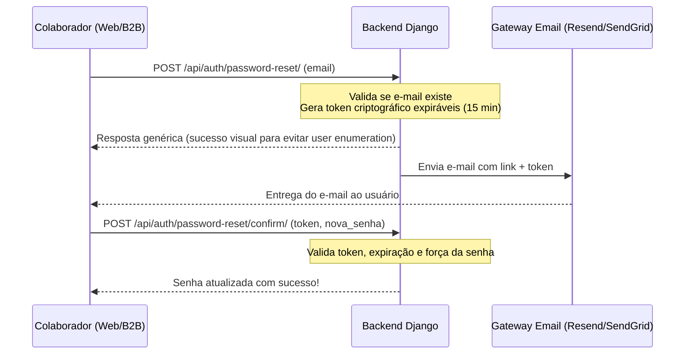
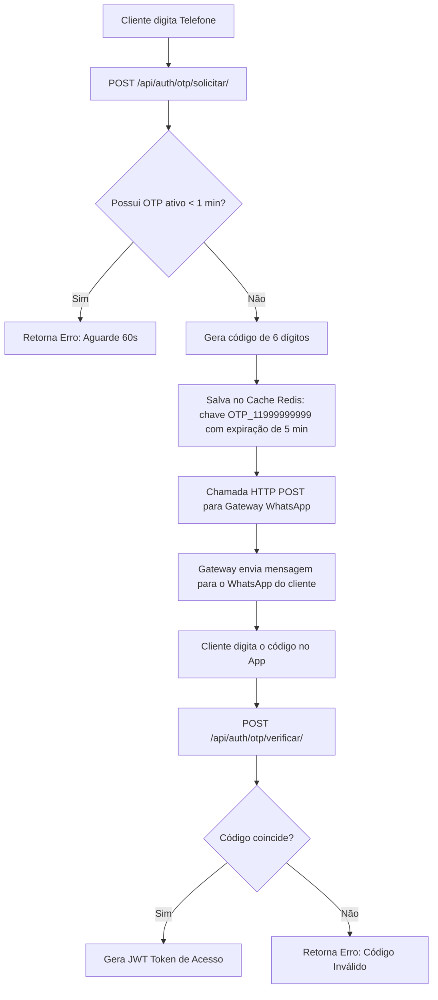

# 🚀 Plano de Finalização e Produção — Lava-Me

Este documento serve como o plano mestre para a **Fase Final** do projeto Lava-Me. Ele detalha as decisões de arquitetura, fluxos de integração e guias operacionais para preparar a plataforma para o deploy real e apresentação pública.

---

## 📋 Sumário
1. [Recuperação de Senhas (Colaboradores)](#1-recuperação-de-senhas-colaboradores)
2. [Login com WhatsApp Real (Clientes)](#2-login-com-whatsapp-real-clientes)
3. [Polimento Visual e UX Premium](#3-polimento-visual-e-ux-premium)
4. [Empacotamento de APKs (Capacitor)](#4-empacotamento-de-apks-capacitor)
5. [Infraestrutura e Deploy de Produção](#5-infraestrutura-e-deploy-de-produção)

---

## 1. Recuperação de Senhas (Colaboradores)
Atualmente, gestores e funcionários que esquecem suas senhas precisam de intervenção manual no banco de dados. Implementaremos um fluxo de autoatendimento via e-mail corporativo.

### 📐 Arquitetura do Fluxo


### 🛠️ Especificação Técnica (Backend)
Usaremos a biblioteca recomendada **`django-rest-passwordreset`** para gerenciar os tokens com segurança contra ataques de força bruta.

1. **Configuração de Dependência**:
   ```bash
   pip install django-rest-passwordreset
   ```
2. **Rota do Link de Redirecionamento**:
   O e-mail conterá o link apontando para o portal web:
   `https://lava.me/reset-password?token=<token_gerado>`
3. **Segurança**:
   - **Rate Limit**: Máximo de 3 solicitações de redefinição por e-mail a cada 1 hora.
   - **Feedback Opaco**: Caso o e-mail não seja encontrado, o backend responde HTTP 200 contendo a mensagem *"Se o e-mail estiver cadastrado, você receberá instruções em instantes"*. Isso mitiga ataques de varredura de usuários.

---

## 2. Login com WhatsApp Real (Clientes)
O aplicativo B2C (`mobile-cliente`) exige login rápido por número de telefone. Vamos substituir o envio simulado (mock) de OTP por mensagens reais utilizando um gateway de integração do WhatsApp.

### 🔌 Escolha do Gateway
* **Recomendado para produção/homologação**: **Z-API** ou **Evolution API** (Docker local).
* **Vantagens**: Custo-benefício excelente (assinatura fixa mensal em vez de cobrança por disparo como na API Oficial Cloud da Meta) e setup simples conectando uma instância de WhatsApp através do escaneamento de QR Code.

### ⚙️ Fluxo de Integração


### 🛡️ Prevenção de Abuso
* **Throttling**: O endpoint de solicitação terá um `SimpleRateThrottle` configurado para aceitar no máximo **1 requisição por minuto** por número de telefone.
* **Tentativas limitadas**: Após **3 tentativas incorretas** na validação do mesmo código, o token é destruído no Redis, obrigando o cliente a solicitar um novo código.

---

## 3. Polimento Visual e UX Premium
Para que o Lava-Me pareça um produto profissional de prateleira, implementaremos as seguintes melhorias de usabilidade:

### 🌟 Lista de Ações de Usabilidade
| Plataforma | Ajuste Proposto | Solução de Engenharia |
| :--- | :--- | :--- |
| **Web (Gestor)** | Efeito de "Carregamento Amnésico" | Substituir loadings em branco ou spinners centrais por **Skeleton Loaders** nas tabelas de Histórico e Painel Financeiro. |
| **Web (Gestor)** | Feedback de ações cruciais | Integração de Toasts interativos (Snackbars) ao reativar/suspender equipe e ao resolver incidentes. |
| **Mobile B2B/B2C** | Duplicidade em inputs de cor | Mudar entrada livre de "Cor" na entrada rápida para um `IonSelect` de cores comuns pré-definidas. |
| **Mobile B2B/B2C** | Formulários "Sujeitos" a cache | Adicionar hook `useIonViewWillLeave` para resetar os states locais de inputs (placa, modelo) ao navegar para trás. |
| **Geral (SPA)** | Feedback visual de botões de salvamento | Alterar label dos botões para "Enviando..." e desabilitar (`disabled`) para evitar requisições duplicadas (Double Click). |

---

## 4. Empacotamento de APKs (Capacitor)
Tanto o app do funcionário (`mobile`) quanto o do cliente (`mobile-cliente`) rodam sobre Ionic + React. Utilizaremos o **Capacitor** para compilar os binários nativos de Android (`.apk`).

### 📋 Passo a Passo para Compilação Android
1. **Instalar Dependências Android SDK**:
   Certifique-se de ter o Android Studio instalado e as variáveis `$ANDROID_HOME` no path do sistema.
2. **Executar o Build Web**:
   ```bash
   npm run build
   ```
3. **Sincronizar com Capacitor**:
   ```bash
   npx cap sync android
   ```
4. **Gerar APK no terminal**:
   Para gerar rapidamente o pacote para instalação local (sem abrir a IDE do Android Studio):
   ```bash
   cd android && ./gradlew assembleDebug
   ```
   *O arquivo gerado estará em:* `android/app/build/outputs/apk/debug/app-debug.apk`
5. **Assinar APK de Produção**:
   Para gerar o APK otimizado e seguro:
   ```bash
   ./gradlew assembleRelease
   ```
   Utilizar `keytool` para gerar sua chave privada e `apksigner` para assinar o arquivo final `.apk`.

---

## 5. Infraestrutura e Deploy de Produção
Para colocar o sistema no ar de forma profissional, abandonaremos o SQLite e os servidores locais executados de forma avulsa. Criaremos uma estrutura de **orquestração por Docker**.

### 🐳 Arquitetura do Docker Compose
O ambiente produtivo consistirá em 5 containers integrados em rede isolada:
1. **`db`**: Banco PostgreSQL persistido em volume externo.
2. **`redis`**: Cache de memória volátil para controle de throttling e OTP.
3. **`backend`**: Aplicação Django rodando via servidor ASGI de alta performance (`Uvicorn` ou `Gunicorn`).
4. **`web`**: Servidor estático (`Nginx` leve) servindo o build de produção do Angular.
5. **`gateway-ssl`**: Proxy reverso principal (Caddy ou Nginx com Certbot) para gerenciar certificados SSL Let's Encrypt de forma automática.

### 📝 Configurações Críticas de Segurança
- `DEBUG = False` no backend Django.
- Chaves de segurança e senhas carregadas via variáveis de ambiente (`.env` ocultado).
- Restrição de CORS permitindo conexões apenas dos domínios oficiais e das origens mobile locais (`capacitor://localhost`).
- Habilitação de cabeçalhos de segurança HTTP (`X-Frame-Options`, `Content-Security-Policy`).

---

## 6. Avaliação do Serviço (NPS / Estrelas)
Para garantir o controle de qualidade contínuo e oferecer um critério de escolha justo aos clientes no portal (mapa), o sistema contará com um fluxo de avaliação pós-serviço.

### 🌟 Dinâmica de Avaliação
1. **Momento da Avaliação**: Apenas disponível quando a Ordem de Serviço atingir o status `FINALIZADO`.
2. **Interface do Cliente (B2C)**: No painel de acompanhamento (ou histórico), o cliente visualizará uma interface para dar uma nota de **1 a 5 estrelas** ao serviço recém-finalizado.
3. **Média do Estabelecimento**:
   - Cada avaliação recebida irá compor uma média ponderada na tabela do `Estabelecimento`.
   - O gestor visualizará a **Média Atual (1.0 a 5.0)** e o total de avaliações diretamente no **Dashboard Web**.
4. **Filtro Geográfico (Mapa B2C)**:
   - Na busca de lava-rápidos no mapa, o cliente poderá **filtrar estabelecimentos a partir de uma nota mínima** (ex: "Mostrar apenas 4+ estrelas").
   - A listagem de estabelecimentos no endpoint do mapa retornará o atributo `avaliacao_media`.

### 🛠️ Especificação Técnica (Backend)
- **Modelos**: 
  - Adição de `avaliacao_estrelas` (IntegerField, 1-5, nullable) na `OrdemServico`.
  - Adição de `avaliacao_media` (DecimalField) no modelo `Estabelecimento` como cache, para otimizar queries espaciais/filtros no mapa.
- **API**:
  - `POST /api/operacao/ordens-servico/<id>/avaliar/`: Endpoint restrito ao cliente dono da OS para submeter a nota.
  - Gatilho (`signal`): Ao receber uma avaliação, recalcula a `avaliacao_media` do estabelecimento com base nas OS finalizadas e avaliadas.
- **Filtro no Mapa**:
  - Modificação em `GET /api/accounts/estabelecimentos/mapa/` para aceitar um query param `nota_minima`.

### 🛡️ Regras de Segurança da Avaliação
1. **Autorização (Ownership)**: Apenas o cliente titular (dono do veículo/agendamento) pode enviar uma avaliação. Funcionários e gestores recebem erro HTTP 403 (Forbidden) se tentarem forjar notas.
2. **Trava de Status**: O endpoint de avaliação deve rejeitar qualquer submissão caso a OS não possua o status exato de `FINALIZADO` (impedindo avaliações prévias ou em OS canceladas).
3. **Prevenção contra Fraudes (Rate/Duplicate)**: O sistema garantirá que a avaliação seja submetida (ou sobrescrita) de forma atômica, garantindo que o cálculo da média do estabelecimento nunca contabilize a mesma OS duas vezes.
4. **Validação Estrita de Dados**: O input da nota (`estrelas`) deve ser estritamente tipado como um número inteiro (1 a 5). Inserções nulas ou notas fora da escala gerarão erro de validação (HTTP 400).
